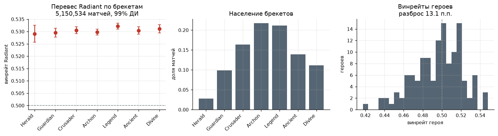
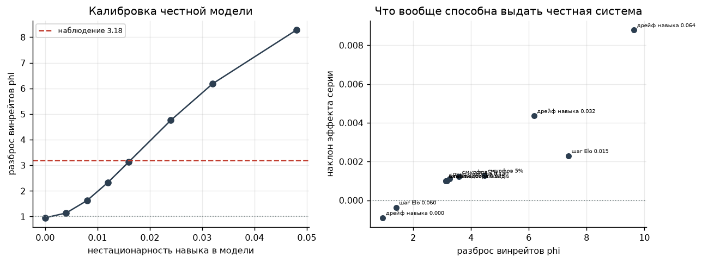
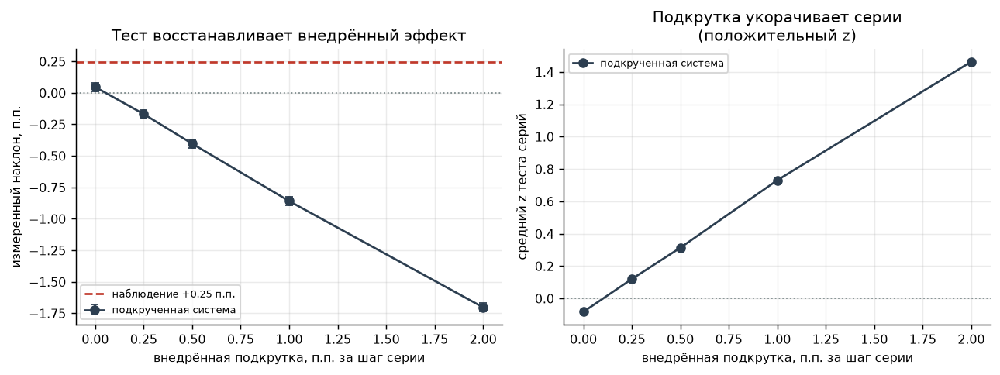
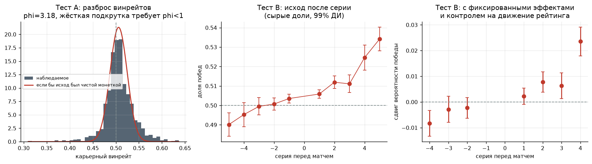
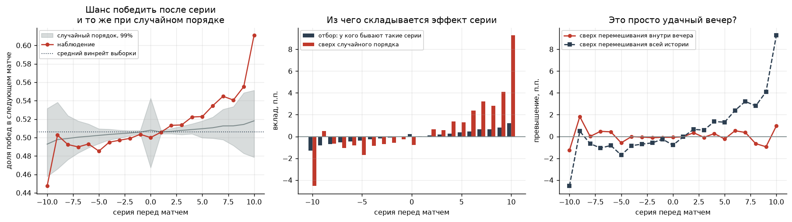
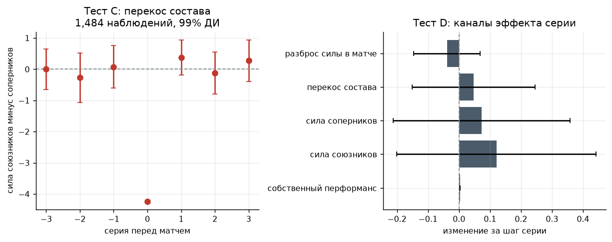
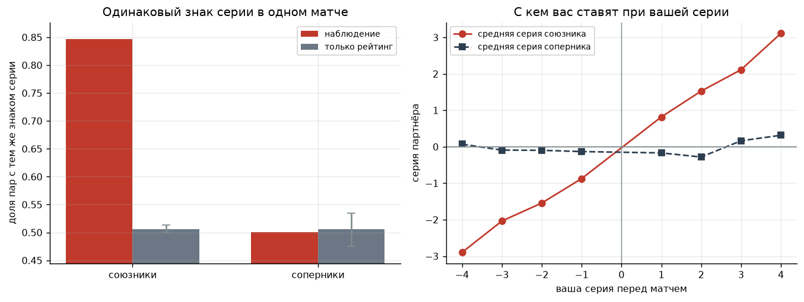
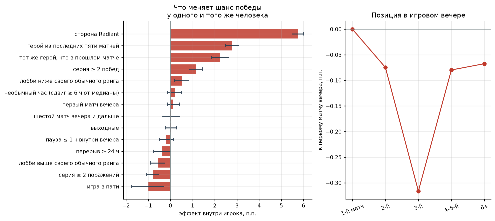
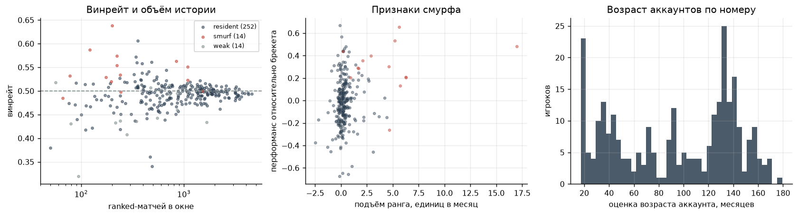

# Существует ли «подкрутка» в матчмейкинге Dota 2

Проверка легенды о том, что система искусственно подтягивает винрейт игрока к 50%. Исследование построено на открытых данных OpenDota; гипотезы, тесты и пороги зафиксированы в [PREREGISTRATION.md](../PREREGISTRATION.md) до сбора данных.

## Короткий ответ

Жёсткая подкрутка, то есть механизм, принудительно сводящий винрейт к 50%, **отвергается**. Разброс карьерных винрейтов оказался в 3.18 раза шире биномиального (99% ДИ 2.54-4.09), тогда как принудительное сведение к 50% требует отношения меньше единицы.

Эффект серии на исход следующего матча оказался **положительный**: +0.26 п.п. за каждый шаг серии (стандартная ошибка 0.023 п.п.). Подкрутка предсказывает отрицательный знак — после победной серии выигрывать должно становиться труднее. Наблюдается обратное.

Честная рейтинговая система, откалиброванная по наблюдаемому разбросу винрейтов, предсказывает наклон +0.10 п.п. Наблюдаемое значение того же знака и того же порядка.

Самый отрицательный наклон, достижимый честной системой при разумных параметрах, составляет -0.09 п.п. Наблюдаемое значение лежит далеко в противоположной стороне, что даёт верхнюю границу на возможную подкрутку.

Тест на разделение механизмов показывает, что зависимость исхода от серии идёт через **собственную игру человека**, а не через состав команды: собственный перформанс меняется на +0.0031 стандартного отклонения за шаг серии.

## Данные

| Показатель | Значение |
| --- | --- |
| Публичных матчей в позитивных контролях | 5,158,382 |
| Игроков в выборке | 4,323 |
| Историй выгружено | 1,274 |
| Матчей игроков всего | 2,954,084 |
| Матчей в основной выборке | 1,314,065 |
| Игроков в основной выборке | 1,270 |
| Матчей с полными составами | 1,146 |

Рамка выборки — случайные публичные ranked-матчи со стратификацией по брекетам, разобранные на участников. Такая выборка взвешена по активности: чем чаще человек играет, тем вероятнее он в неё попадёт. Именно она отвечает на вопрос «как устроен типичный матч».

Основная выборка ограничена ranked-матчами 2023 года и позже продолжительностью не менее десяти минут, доигранными до конца. Ограничение по дате вынужденное: поле `average_rank`, единственный доступный прокси рейтинга, заполнено почти у всех современных матчей и почти ни у одного старого.

## Позитивные контроли: работает ли конвейер

Прежде чем делать выводы из отсутствия эффекта, надо убедиться, что конвейер способен обнаружить эффект известного размера. Иначе нулевой результат мог бы объясняться поломкой обработки.

На 5,158,382 публичных ranked-матчах воспроизводится известный перевес стороны Radiant: **0.5307** (99% ДИ 0.5301-0.5313). Он устойчив во всех брекетах, то есть не является артефактом выборки.

| Брекет | Матчей | Винрейт Radiant |
| --- | --- | --- |
| Herald | 144,297 | 0.5289 |
| Guardian | 507,858 | 0.5295 |
| Crusader | 841,483 | 0.5306 |
| Archon | 1,120,081 | 0.5298 |
| Legend | 1,091,026 | 0.5322 |
| Ancient | 716,952 | 0.5305 |
| Divine | 576,157 | 0.5311 |

Винрейты героев различаются на 13.1 процентных пункта — конвейер видит и этот заведомо существующий эффект.

### Расхождение с предрегистрацией

Третьим контролем было заявлено преимущество игры в пати над соло. В данных оно оказалось **обратным**: у одних и тех же игроков матчи в пати выигрываются на 1.00 процентных пункта реже, чем соло (99% ДИ -1.83 п.п. … -0.17 п.п., 265,354 матчей).

Так что этот контроль не подтвердился в заявленном направлении, и скрывать это было бы неправильно. Два обстоятельства делают результат объяснимым. Во-первых, Valve открыто применяет к пати поправки в подборе, подставляя им более сильных соперников, так что отрицательный знак не противоречит устройству системы. Во-вторых, поле `party_size` заполнено лишь у 34% матчей и крайне неравномерно по годам, поэтому оценка ограничена периодами с приемлемым покрытием и всё равно остаётся хрупкой.

Попутно это напоминание, что матчмейкер **действительно** учитывает не только рейтинг: состав пати он видит и на подбор им реагирует. Но это открыто документированная поправка, а не скрытое управление исходом, о котором говорит легенда.

## Нулевая модель: чего ждать от честной системы

Это ключевой момент всего исследования. Винрейт около 50% — это **неподвижная точка любой рейтинговой системы**, а не доказательство вмешательства: подбирая равных соперников, система автоматически приводит стабильного игрока к равному счёту. Более того, в честной системе возникает и зависимость исхода от предыдущей серии, потому что после победы рейтинг вырос и следующий соперник сильнее.

Поэтому наблюдения сравниваются не с нулём, а с симулятором честного матчмейкинга: рейтинг по Elo, подбор строго по рейтингу, исход только от силы команд, никакой подкрутки по построению.

Оказалось, что предсказания честной системы сильно зависят от того, насколько подвижен навык игроков: разброс винрейтов пробегает диапазон от 0.95 до 9.64, а наклон эффекта серии — от -0.09 п.п. до +0.88 п.п. Точечное сравнение с одной симуляцией было бы поэтому бессмысленным.

Решение: единственный свободный параметр модели, нестационарность навыка, подбирается так, чтобы совпал наблюдаемый разброс винрейтов. После этого наклон эффекта серии перестаёт быть подгоняемой величиной и становится **предсказанием** модели, которое можно честно сравнить с наблюдением.

Откалиброванная модель предсказывает наклон +0.10 п.п.

Честное замечание о пределах модели: наблюдаемая подвижность ранга (0.349 от разброса рангов в популяции) выше той, что воспроизводит откалиброванная модель. Расхождение ожидаемо — в Dota 2 есть сезонные пересчёты рейтинга и шум измерения `average_rank`, которых в модели нет.

## Негативный контроль: а увидели бы мы подкрутку, если бы она была

Позитивные контроли доказывают, что конвейер видит известные эффекты в данных. Здесь проверяется обратное и не менее важное: что **сами тесты чувствительны к подкрутке**. В симулятор внедряется вмешательство известной силы, и измеряется, как на него реагируют статистики. Без такой проверки вывод «эффекта не найдено» ничего не стоил бы: он мог бы означать, что тесты слепы.

| Внедрено, п.п. за шаг | Измеренный наклон | Средний z теста серий |
| --- | --- | --- |
| 0.00 | +0.04 п.п. | -0.084 |
| 0.25 | -0.17 п.п. | +0.124 |
| 0.50 | -0.42 п.п. | +0.331 |
| 1.00 | -0.86 п.п. | +0.738 |
| 2.00 | -1.68 п.п. | +1.454 |

Тест восстанавливает внедрённый эффект почти один к одному: при внедрении 2.0 п.п. измеренный наклон сдвигается на -1.73 п.п. Знак меняется уже при самой слабой из проверенных подкруток в 0.25 п.п.

Наблюдаемое значение +0.26 п.п. отстоит от результата самой слабой смоделированной подкрутки на 18 стандартных ошибок. Подкрутка такого размера в данных исключена.

Отдельная находка касается механизма. Если бы система перекашивала **составы** внутри матча, эффект был бы слабым при любой силе вмешательства: подобранные в один матч игроки почти равны по рейтингу, поэтому перестановка их между командами физически не способна сильно сдвинуть исход. Заметная подкрутка через состав потребовала бы расширения окна подбора, а это наблюдаемо — и проверяется отдельным каналом в тесте D.

## Тест A: разброс карьерных винрейтов

Логика теста. Если бы система жёстко тянула каждого к 50%, наблюдаемый разброс винрейтов оказался бы **уже** биномиального шума: система гасила бы отклонения, которые при честной случайности обязаны накапливаться. Недодисперсия при честной игре практически недостижима, поэтому это самый сильный фальсифицирующий признак во всём исследовании.

| Показатель | Значение |
| --- | --- |
| Игроков в когорте | 1,050 |
| Матчей | 1,293,664 |
| Средний винрейт | 0.5059 |
| Наблюдаемый разброс | 0.0310 |
| Разброс при чистой случайности | 0.0187 |
| Коэффициент дисперсии phi | 3.184 (99% ДИ 2.537-4.091) |
| Разброс истинных винрейтов | 0.0248 |

**Вывод — сверхдисперсия: жёсткая подкрутка отвергается.**

Содержательно это означает, что различия между игроками реальны: после вычитания случайного шума стандартное отклонение истинного винрейта составляет 0.0248, то есть около 2.5 процентных пунктов. Система эти различия не стирает.

Проверка на смурфов: после их исключения phi составляет 3.127 против 3.184 на полной выборке. Избыточный разброс не сводится к смурфам.

## Тест B: влияет ли серия на следующий матч

| Серия перед матчем | Матчей | Доля побед | 99% ДИ |
| --- | --- | --- | --- |
| -5 | 46,587 | 0.4901 | 0.4842-0.4961 |
| -4 | 43,137 | 0.4953 | 0.4891-0.5015 |
| -3 | 84,040 | 0.4995 | 0.4950-0.5039 |
| -2 | 164,684 | 0.5007 | 0.4975-0.5039 |
| -1 | 324,136 | 0.5035 | 0.5013-0.5058 |
| +0 | 160 | 0.5500 | 0.4487-0.6473 |
| +1 | 325,098 | 0.5059 | 0.5036-0.5081 |
| +2 | 161,140 | 0.5119 | 0.5087-0.5151 |
| +3 | 80,759 | 0.5111 | 0.5066-0.5156 |
| +4 | 40,503 | 0.5246 | 0.5182-0.5310 |
| +5 | 43,821 | 0.5342 | 0.5280-0.5403 |

Сырые доли смешивают два разных явления: сильные игроки и выигрывают чаще, и чаще имеют длинные победные серии. Поэтому основная оценка делается с фиксированными эффектами игрока, то есть сравнивает матчи одного и того же человека между собой, а стандартные ошибки кластеризуются по игроку.

| Оценка | Наклон за шаг серии |
| --- | --- |
| Наблюдение | +0.26 п.п. (SE 0.023 п.п.) |
| Наблюдение с контролем на движение ранга, пати и позицию в сессии | +0.28 п.п. |
| Предсказание честной модели | +0.10 п.п. |
| Разница | +0.16 п.п. (p=0.0000) |

**Знак противоположен предсказанию подкрутки.** Гипотеза о наказании за победную серию требует отрицательного наклона: после побед выигрывать должно становиться труднее. В данных наблюдается обратное — победы слабо, но устойчиво предсказывают следующую победу.

Проверка гипотезы о таргетированном вмешательстве: наклон после побед составляет +0.45 п.п., после поражений +0.11 п.п. Разница +0.34 п.п. при p=0.0000.

Непараметрическая проверка структуры последовательности (тест Уолда-Вольфовица) по 1,150 игрокам даёт средний z = -0.335: серии длиннее, чем при случайной последовательности. Подкрутка предсказывала бы противоположный знак, поскольку сглаживание серий — это и есть её наблюдаемое проявление.

## Выиграл N подряд — каков шанс выиграть следующий матч

Сырой факт простой: чем длиннее победная серия, тем чаще выигрывается следующий матч. После одной победы шанс 0.5057, после десяти и больше — 0.6110. Средний винрейт выборки при этом 0.5059. Зависимость от N есть.

Но из этого ещё нельзя сказать, *почему*. Один и тот же график дают три совсем разных механизма, и их нужно разделить.

1. **Отбор.** До десяти побед подряд чаще добираются сильные игроки. Тогда 61% — это не «серия меняет матч», а «перед нами человек, который и так выигрывает чаще среднего».
2. **Подкрутка.** Система увидела серию и нарочно подобрала более лёгкий или более тяжёлый матч.
3. **Форма.** Тот же человек сегодня играет иначе, чем вчера: разыгрался, выбрал удобных героев, не устал — или наоборот. Серия тут только *признак* удачного вечера, а не причина.

Крайние строки таблицы означают «N и больше».

| Серия побед | Матчей | Шанс победить | Вклад отбора | Сверх случайного порядка |
| --- | --- | --- | --- | --- |
| **1** | 323,215 | 0.5057 | +0.02 п.п. | -0.04 п.п. |
| **2** | 163,292 | 0.5132 | +0.08 п.п. | +0.65 п.п. |
| **3** | 83,733 | 0.5137 | +0.19 п.п. | +0.59 п.п. |
| **4** | 42,975 | 0.5223 | +0.27 п.п. | +1.37 п.п. |
| **5** | 22,426 | 0.5227 | +0.37 п.п. | +1.32 п.п. |
| **6** | 11,709 | 0.5345 | +0.47 п.п. | +2.38 п.п. |
| **7** | 6,254 | 0.5448 | +0.67 п.п. | +3.22 п.п. |
| **8** | 3,405 | 0.5407 | +0.67 п.п. | +2.80 п.п. |
| **9** | 1,841 | 0.5551 | +0.83 п.п. | +4.09 п.п. |
| **≥10** | 2,622 | 0.6110 | +1.22 п.п. | +9.29 п.п. |

### Разбор на одном числе: десять побед подряд

После ≥10 побед следующий матч выигрывается в **0.6110** случаев. Это число можно сложить из трёх кусков:

* средний игрок выборки: 0.5059;
* плюс отбор (такие серии чаще бывают у сильных): +1.22 п.п.;
* плюс то, что осталось сверх отбора: +9.29 п.п.

Отбор почти ничего не даёт — всего +1.22 п.п. даже на самой длинной серии. Почти весь скачок к 61% живёт *внутри одного и того же человека*: в одни дни он выигрывает пачками, в другие нет.

Как это посчитано. Берём историю каждого игрока и **перемешиваем порядок его побед и поражений**, оставляя его винрейт и число матчей как есть. Сильный остаётся сильным, слабый — слабым, но кластеры побед разбиваются. Потом снова спрашиваем: если у такого перемешанного игрока случайно выпало 10 побед подряд, каков шанс 11-й? Это и есть столбец «вклад отбора». Всё, что в реальных историях выше этой цифры, отбором объяснить нельзя.

### Почему остаток — это вечер, а не матчмейкинг

Остаток ещё не доказывает подкрутку. Он означает только: победы у одного человека идут пачками чаще, чем если бы каждый его матч был независимым броском с его средним винрейтом. Пачки могут давать и «сегодня зашёл», и скрытый алгоритм.

Чтобы их разделить, перемешиваем уже не всю карьеру, а **только матчи внутри одного вечера**. Вторник, где человек выиграл 6 из 8, так и остаётся вечером с 6 победами. Меняется лишь порядок этих восьми исходов. Если бы сама серия что-то меняла — система подкручивала следующий матч, увидев три победы подряд, — реальный порядок всё равно выбивался бы из такого перемешивания. Мы бы видели: после трёх побед *подряд* шанс выше, чем после трёх побед за вечер в любом порядке.

Не выбивается: из 9 длин серии 8 лежат внутри 99-процентного интервала такого нулевого закона. Зная, насколько удачным был вечер, порядок матчей внутри него почти ничего не добавляет. Серия — ярлык удачного вечера, а не отдельная причина.

Тот же вывод можно проверить в лоб, без перемешивания. Смотрим следующий матч после побед и после поражений — но разделяем, сыгран ли он **в тот же вечер** или это **первый матч после перерыва** (человек вышел, поспал, зашёл снова). На бумаге серия та же: вчерашние четыре победы никуда не делись.

| Когда играется следующий матч | После побед | После поражений | Разрыв |
| --- | --- | --- | --- |
| серия внутри одного вечера | 0.5196 | 0.4938 | +2.58 п.п. |
| первый матч вечера | 0.5136 | 0.5039 | +0.97 п.п. |

В том же вечере разрыв +2.58 п.п.: после побед выигрывают заметно чаще, чем после поражений. После сна разрыв сжимается до +0.97 п.п. — перерыв съедает 62% эффекта.

Вот что из этого следует. Алгоритм, который смотрит только на последние исходы («четыре победы, дать тяжелее / легче»), **не знает, что вы спали**. Счётчик серии не обнуляется от перерыва. Если бы скачок шанса делал такой алгоритм, разрыв после сна остался бы тем же. Он не остаётся.

А форма человека сон замечает: разыгранность проходит, усталость сбрасывается, «зашёл сегодня» заканчивается. Это совпадает с тем, что видно в данных, и с тестом D: эффект серии идёт через собственную игру, не через состав команды.

Картина одна и та же во всех брекетах (превышение над случайным порядком от -0.50 п.п. до +0.86 п.п.), то есть это не особенность Herald или Divine.

## Тест C: перекос состава команды

Самый прямой из возможных тестов. Если система «наказывает» за победную серию, у неё есть ровно один рычаг — состав матча. Поэтому измеряется разница средней силы четырёх союзников и пяти соперников как функция серии. При честном подборе это математический ноль при любой серии.

Наблюдений: 1,484 по 1,067 игрокам. Средний перекос +0.0556 (SE 0.1057).

| Серия | Наблюдений | Перекос союзники минус соперники |
| --- | --- | --- |
| -3 | 274 | +0.001 ± 0.251 |
| -2 | 237 | -0.272 ± 0.306 |
| -1 | 248 | +0.071 ± 0.264 |
| +1 | 272 | +0.372 ± 0.216 |
| +2 | 227 | -0.128 ± 0.260 |
| +3 | 225 | +0.272 ± 0.259 |

Перекос измеряется в единицах ранга, то есть в звёздах медали. Наклон по серии составил +0.04444 (SE 0.08720) — неотличимо от нуля, тогда как подкрутка требует значимо отрицательного значения.

Чтобы эту границу можно было сопоставить с тестом B, она переведена в вероятность победы. Единица перекоса стоит +0.0127 вероятности победы, поэтому вклад подбора состава в эффект серии составляет +0.06 п.п. с 99% интервалом -0.24 п.п. … +0.35 п.п.

**Это и есть количественный ответ теста C:** через состав команды матчмейкинг может смещать шанс на победу не более чем на 0.24 процентных пункта за шаг серии, причём точечная оценка имеет знак, противоположный подкрутке.

Проверка на устойчивость: если силу игроков мерить только рангом из данных матча, не примешивая независимую оценку по истории, наклон составляет +0.10428 (SE 0.11127) — вывод не меняется.

Ограничение теста: в среднем 5% участников матча скрывают профиль, и их сила ненаблюдаема. Отбор при этом смещён в сторону матчей с открытыми профилями: наблюдения, где известна сила менее чем двух игроков на сторону, отбрасываются.

## Тест D: тильт или подкрутка

Два совершенно разных механизма дают одинаковую зависимость исхода от серии, и различить их — самая содержательная часть работы:

* тильт и усталость меняют игру **самого человека**;
* подкрутка меняет **состав его команды**.

Разделить их можно, потому что первый механизм виден в собственном перформансе игрока, а второй — в силе союзников и соперников.

| Канал | Изменение за шаг серии | 99% ДИ | Наблюдений |
| --- | --- | --- | --- |
| собственный перформанс игрока | +0.00306 | +0.00184 … +0.00427 | 1,314,062 |
| сила союзников | +0.12063 | -0.20011 … +0.44137 | 537 |
| сила соперников | +0.07311 | -0.21160 … +0.35782 | 537 |
| перекос состава | +0.04752 | -0.15110 … +0.24614 | 537 |
| разброс силы внутри матча | -0.03887 | -0.14598 … +0.06824 | 537 |

Собственный перформанс игрока растёт вместе с серией: +0.00306 стандартного отклонения за шаг, и это единственный канал, где интервал не накрывает ноль. Каналы состава — сила союзников, сила соперников, перекос между ними и разброс силы внутри матча — все нулевые.

Разделение получилось: зависимость исхода от серии проходит через самого человека, а не через то, кого ему подобрали. Причём знак говорит не о тильте, а об обратном — после побед люди играют лучше. Правдоподобные объяснения обыденны: разыгранность, удачный вечер, выбор освоенных героев, отсутствие усталости.

## Есть ли отдельные очереди поиска — win queue и lose queue

Легенда звучит так: при поиске матча вас кладут не в общую очередь, а в одну из нескольких. После побед — в lose queue, после поражений — в win queue. Дальше есть два варианта, и они дают разные следы в данных.

**Одна очередь на весь матч.** Все десять игроков взяты из одного пула. Тогда и союзник, и соперник чаще имеют тот же знак серии, что и вы: после ваших четырёх побед вокруг тоже люди на победных сериях.

**Очередь на команду.** Вашу пятёрку набрали из одной очереди, вражескую — из другой. Тогда союзники похожи на вас по серии, а соперники — наоборот.

Третий вариант — «lose queue значит, что вам устроят поражение» — это уже не про состав очереди, а про исход. Его отвергает тест B: после побед выигрывают чаще, а не реже.

Честный подбор по рейтингу сам по себе чуть-чуть склеивает знаки серий: сильные чаще бывают на победной серии, а в один матч попадают близкие по рейтингу. Поэтому наблюдение сравнивается не с 50%, а с нулевым законом, где серии перемешаны внутри брекета и недели, а кто с кем попал в матч не меняется. Остаётся только та похожесть, которую мог бы дать отдельный пул.

В выборке 31,348 матчей, где есть хотя бы двое игроков с известной историей. Из них собрано 68,942 направленных пар (65,184 союзники, 3,758 соперники). Решающая проверка — соперники: 1,195 матчей, где двое наших игроков оказались в разных командах.

| Пары | Один знак серии | Нуль: только рейтинг | Сверх нуля |
| --- | --- | --- | --- |
| союзники | 0.8465 | 0.5062 (0.4995 … 0.5134) | +34.03 п.п. |
| соперники | 0.5008 | 0.5056 (0.4747 … 0.5341) | -0.48 п.п. |

У **соперников** избыток похожести -0.48 п.п. и лежит внутри нулевого закона. Это решающая проверка: соперники не могут быть из одной пати, и именно они выдают общий пул поиска. Отдельной очереди на весь матч в данных нет.

У союзников похожесть гораздо выше (+34.03 п.п. сверх нуля). Это 2,622 постоянных пар, которые играют вместе в среднем 25 раз — пати, а не очередь поиска. На соперников этот канал не действует, и именно поэтому союзники здесь не доказательство очередей.

Корреляция длины серии с серией соперника +0.010 при нуле +0.019. Даже слабая «чуть похожая форма у всего лобби» не появляется.

Чувствительность: очередь, которая забирала бы больше 7% матчей в чистый пул одного знака, подняла бы похожесть соперников выше верхней границы нуля. Такого сдвига нет. Более тонкая очередь — редкая или слабо связанная с серией — могла бы спрятаться внутри этих 3.3 п.п.

Что этим нельзя закрыть. Скрытая очередь, которая **не** смотрит на серию побед и поражений — например, на поведение или скрытый рейтинг вовлечения — в этих данных не видна. Проверяется только легенда «после стрика тебя кладут в win/lose queue».

## Какие зависимости вообще есть

Вопрос простой: что меняет *ваш* шанс выиграть следующий матч, а что нет.

Почему нельзя просто усреднить все игры. Пример. В пати играют чаще сильные. Если сложить все пати-матчи скопом, они могут выглядеть как обычные 50/50 — не потому что пати ничего не делает, а потому что там сидят другие люди. Поэтому каждое сравнение такое: берём **ваши** игры в пати и **ваши же** соло, потом то же у следующего человека, и усредняем эти личные разницы. Число в таблице — насколько у вас лично чаще (или реже) победа, когда условие выполняется.

| Что сравниваем | Вы выигрываете… | Простыми словами |
| --- | --- | --- |
| сторона Radiant | на 5.7% чаще | Карта слегка удобнее за светлую сторону. Вам её почти случайно назначают, это не «подкрутка». |
| герой из последних пяти матчей | на 2.8% чаще | На герое, которого вы недавно играли, получается лучше. Вы сами играете увереннее, не лобби другое. |
| тот же герой, что в прошлом матче | на 2.2% чаще | То же самое, ещё уже: повторили пик прошлого матча — чуть чаще победа. |
| серия ≥ 2 побед | на 1.1% чаще | После двух побед подряд вы сами играете лучше. Не «система дала лёгкое лобби». |
| игра в пати | на 1.0% реже | Когда вы встаёте в пятёрку, побеждать становится чуть труднее. Valve открыто ставит пати более сильных соперников. Если просто сложить все пати скопом, разницы почти не видно — в пати чаще заходят более сильные игроки, и это замазывает штраф. |
| серия ≥ 2 поражений | на 0.8% реже | После двух поражений подряд вы сами играете хуже. |
| лобби выше своего обычного ранга | на 0.6% реже | Вас поставили в матч, где средний ранг выше вашего обычного. Соперники сильнее — выигрывать труднее. Так и должен работать рейтинг. |
| лобби ниже своего обычного ранга | на 0.5% чаще | Обратное: лобби слабее обычного — выигрывать легче. Снова рейтинг, не очередь. |
| перерыв ≥ 24 ч | на 0.4% реже | Сутки не играли — почти как обычно. Если что-то и есть, это меньше половины процента и может быть шумом. |
| необычный час (сдвиг ≥ 6 ч от медианы) | на 0.2% чаще | Сели в необычное для себя время суток — шанс тот же. |
| пауза ≤ 1 ч внутри вечера | на 0.2% реже | Перекур на час внутри вечера ничего не меняет. |
| первый матч вечера | на 0.1% чаще | Первый каток дня такой же, как остальные. |
| шестой матч вечера и дальше | никак | Шестой каток за вечер не хуже первого. «Усталость ломает винрейт» в этих данных не видно. |
| выходные | никак | Суббота и воскресенье как будни. |

Самое большое — сторона: за Radiant вы выигрываете на 5.7% чаще, чем за Dire. Это давно известно и к скрытым очередям не относится.

Самый показательный пример, зачем сравнивать человека с самим собой — пати. По всем играм скопом пати и соло выглядят одинаково. А если взять ваши пати против ваших соло, пати проигрывает на 1.0% реже. Разница прячется, потому что в пати чаще заходят люди сильнее среднего.

Что **не** меняет ваш шанс: перерыв ≥ 24 ч, необычный час (сдвиг ≥ 6 ч от медианы), пауза ≤ 1 ч внутри вечера, первый матч вечера, шестой матч вечера и дальше, выходные. Время суток, день недели и «уже шестой каток» можно вычеркнуть.

Ещё одно, не про победу, а про то, уходите ли вы. После победы ещё один каток в тот же вечер запускают в 64% случаев, после поражения — в 64%. Почти одинаково. История «проигравшие тильтуют и ливают, в поиске остаются одни неудачники» здесь не срабатывает.

## Кто населяет рейтинг: смурфы, слабые игроки и постоянные жители

Смурфы — главный конфаундер исследования. Они дают настоящие 60-70% побед, раздувают хвосты распределения винрейтов и создают у соседей по матчу то самое ощущение несбалансированных команд, которое и породило легенду о подкрутке.

| Когорта | Игроков | Винрейт | Подъём ранга в месяц | Перформанс |
| --- | --- | --- | --- | --- |
| житель рейтинга | 1,083 | 0.5078 | +0.36 | -0.02 |
| смурф | 61 | 0.5521 | +4.72 | +1.61 |
| слабый игрок | 61 | 0.4529 | -0.44 | -1.29 |

Признаки смурфа: быстрый подъём по брекетам, перформанс выше уровня своего брекета с самых первых матчей, молодой аккаунт. Возраст аккаунта оценивается по двум независимым источникам — полной истории матчей до окна исследования и калибровочной кривой, связывающей номер аккаунта с датой регистрации, поскольку Steam выдаёт номера почти монотонно по времени.

Проверка на заведомых случаях — молодые аккаунты, добравшиеся до Divine, против аккаунтов с многолетней стабильной историей — даёт AUC 0.845, а без возрастной компоненты, от которой зависит сама проверочная метка, 0.805.

Это проверка согласованности, а не независимая валидация: настоящей разметки смурфов не существует, и любая метка здесь строится из тех же наблюдаемых величин.

## Ответ на исходный вопрос

**Свидетельств подкрутки не обнаружено, и это утверждение количественное.**

1. Жёсткая подкрутка отвергается: разброс винрейтов в 3.18 раза шире случайного, тогда как принуждение к 50% требует значения меньше единицы. Устойчивые различия между игроками существуют и системой не стираются.

2. Направление эффекта серии противоположно предсказанию подкрутки: наблюдается +0.26 п.п. за шаг, то есть победы слегка предсказывают победы, а не наоборот.

3. Наблюдаемая зависимость исхода от серии по знаку и порядку совпадает с тем, что даёт заведомо честная система (+0.10 п.п.).

4. Механизм зависимости от серии удалось локализовать: он проходит через собственную игру человека, а не через состав команды.

5. Возможное вмешательство через состав команды ограничено сверху величиной 0.24 п.п. за шаг серии.

6. Отдельных очередей поиска по знаку серии не видно: у соперников в одном матче одинаковый знак серии отличается от нуля подбора по рейтингу на -0.48 п.п.

7. Чувствительности при этом хватает с запасом: негативный контроль показал, что тест восстанавливает внедрённую подкрутку почти один к одному, а значит уверенно различает вмешательство начиная примерно с 0.07 п.п. за шаг серии.

Что при этом **правда** в народном наблюдении: винрейт действительно стремится к 50%. Но это следствие того, что система подбирает равных соперников, а не того, что она подкручивает результат. Разница между этими объяснениями не философская: они дают разные проверяемые предсказания, и данные согласуются со вторым.

## Ограничения

1. **Селекция по публичности профиля.** История видна только у игроков, открывших статистику. При выгрузке около 60% встреченных аккаунтов вернули пустую историю, и они могут отличаться от вошедших в выборку.
2. **Селекция выживших.** Игроки с длинной историей — это те, кто не бросил игру, а бросают чаще проигрывающие.
3. **Нет прямого доступа к MMR.** Valve закрыла его в API, поэтому движение рейтинга измеряется через `average_rank` матча.
4. **Тест C ограничен** объёмом выгруженных составов и приватностью: сила скрытых участников ненаблюдаема.
5. **Наблюдательные данные.** Рандомизации нет, поэтому результат — это ограничение сверху на размер возможного эффекта, а не доказательство отсутствия механизма.
6. **Нулевая модель — семейство, а не точка.** Её предсказания зависят от предполагаемой нестационарности навыка, поэтому сравнение проводится и с откалиброванной точкой, и с диапазоном достижимого.

## Приложение: все зафиксированные величины

| Тест | Метрика | Значение | 99% ДИ | n | Примечание |
| --- | --- | --- | --- | --- | --- |
| A_dispersion | phi_real | 3.18449 | 2.5371 … 4.0912 | 1,050 | сверхдисперсия: жёсткая подкрутка отвергается |
| A_dispersion | true_winrate_sd | 0.02478 | — | 1,050 | разброс истинных винрейтов после снятия биномиального шума |
| B_hotstreak | p_win_after_10_wins | 0.61098 | — | 2,622 | отбор даёт +0.0122, сверх случайного порядка +0.0929 |
| B_hotstreak | p_win_after_1_wins | 0.50574 | — | 323,215 | отбор даёт +0.0002, сверх случайного порядка -0.0004 |
| B_hotstreak | p_win_after_2_wins | 0.51322 | — | 163,292 | отбор даёт +0.0008, сверх случайного порядка +0.0065 |
| B_hotstreak | p_win_after_3_wins | 0.51366 | — | 83,733 | отбор даёт +0.0019, сверх случайного порядка +0.0059 |
| B_hotstreak | p_win_after_4_wins | 0.52230 | — | 42,975 | отбор даёт +0.0027, сверх случайного порядка +0.0137 |
| B_hotstreak | p_win_after_5_wins | 0.52274 | — | 22,426 | отбор даёт +0.0037, сверх случайного порядка +0.0132 |
| B_hotstreak | p_win_after_6_wins | 0.53446 | — | 11,709 | отбор даёт +0.0047, сверх случайного порядка +0.0238 |
| B_hotstreak | p_win_after_7_wins | 0.54477 | — | 6,254 | отбор даёт +0.0067, сверх случайного порядка +0.0322 |
| B_hotstreak | p_win_after_8_wins | 0.54068 | — | 3,405 | отбор даёт +0.0067, сверх случайного порядка +0.0280 |
| B_hotstreak | p_win_after_9_wins | 0.55513 | — | 1,841 | отбор даёт +0.0083, сверх случайного порядка +0.0409 |
| B_hotstreak | spread_after_break | 0.00968 | — | 472,772 | первый матч вечера: после побед 0.5136, после поражений 0.5039 |
| B_hotstreak | spread_same_session | 0.02578 | — | 841,133 | серия внутри одного вечера: после побед 0.5196, после поражений 0.4938 |
| B_streaks | asymmetry | 0.00336 | — | 1,314,065 | наклон после побед минус после поражений, p=0.0000 |
| B_streaks | runs_mean_z | -0.33454 | — | 1,150 | отрицательный знак означает более длинные серии, чем при случайности |
| B_streaks | slope_diff | 0.00159 | — | 1,314,065 |  |
| B_streaks | slope_diff_p | 0.00000 | — | 1,314,065 | реальность против откалиброванной честной модели |
| B_streaks | slope_null_model | 0.00099 | — | 1,314,065 |  |
| B_streaks | slope_real | 0.00258 | — | 1,314,065 |  |
| B_streaks | slope_real_controlled | 0.00276 | — | 1,314,065 |  |
| C_roster | channel_in_winrate | 0.00056 | -0.0024 … 0.0035 | 1,484 | вклад подбора состава в эффект серии, в вероятности победы |
| C_roster | delta_slope | 0.04444 | -0.1802 … 0.2691 | 1,484 | перекос состава как функция серии; ноль — честный подбор |
| C_roster | delta_slope_rank_only | 0.10428 | -0.1823 … 0.3909 | 1,479 | проверка на однородной мере силы |
| C_roster | mean_delta | 0.05564 | -0.2167 … 0.3280 | 1,484 |  |
| D_cohorts | smurf_auc | 0.84536 | — | 548 | AUC разделения заведомых смурфов и жителей рейтинга; без возрастной компоненты 0.805 |
| D_cohorts | smurf_share | 0.05066 | — | 1,204 |  |
| D_cohorts | weak_share | 0.05066 | — | 1,204 |  |
| D_decomposition | ally_skill | 0.12063 | -0.2001 … 0.4414 | 537 | сила союзников |
| D_decomposition | delta | 0.04752 | -0.1511 … 0.2461 | 537 | перекос состава |
| D_decomposition | enemy_skill | 0.07311 | -0.2116 … 0.3578 | 537 | сила соперников |
| D_decomposition | own_performance | 0.00306 | 0.0018 … 0.0043 | 1,314,062 | собственный перформанс |
| D_decomposition | skill_spread | -0.03887 | -0.1460 … 0.0682 | 537 | разброс силы в матче |
| E_controls | hero_winrate_spread | 0.13086 | — | 19,769,530 | Nature's Prophet 0.418 .. Wraith King 0.548 |
| E_controls | party_advantage | -0.01000 | -0.0183 … -0.0017 | 265,354 | пати 0.5060 против соло 0.5092; поле party_size заполнено у 34% матчей |
| E_controls | radiant_winrate | 0.53069 | 0.5301 … 0.5313 | 5,158,382 | публичные ranked-матчи за 10 суток |
| E_controls | radiant_winrate_Ancient | 0.53053 | 0.5290 … 0.5320 | 716,952 |  |
| E_controls | radiant_winrate_Archon | 0.52979 | 0.5286 … 0.5310 | 1,120,081 |  |
| E_controls | radiant_winrate_Crusader | 0.53058 | 0.5292 … 0.5320 | 841,483 |  |
| E_controls | radiant_winrate_Divine | 0.53111 | 0.5294 … 0.5328 | 576,157 |  |
| E_controls | radiant_winrate_Guardian | 0.52950 | 0.5277 … 0.5313 | 507,858 |  |
| E_controls | radiant_winrate_Herald | 0.52894 | 0.5256 … 0.5323 | 144,297 |  |
| E_controls | radiant_winrate_Legend | 0.53225 | 0.5310 … 0.5335 | 1,091,026 |  |
| E_controls | radiant_winrate_duration_long | 0.49559 | 0.4946 … 0.4966 | 1,689,471 |  |
| E_controls | radiant_winrate_duration_medium | 0.53606 | 0.5353 … 0.5368 | 3,001,603 |  |
| E_controls | radiant_winrate_duration_short | 0.62303 | 0.6212 … 0.6249 | 467,308 |  |
| E_queues | corr_enemy | 0.00984 | -0.0448 … 0.0828 | 3,758 | корреляция серии с серией соперника; ноль — один пул; сверх нуля -0.0095 |
| E_queues | same_sign_ally | 0.84653 | 0.4995 … 0.5134 | 65,184 | доля пар союзников с тем же знаком серии; сверх нуля +0.3403 |
| E_queues | same_sign_enemy | 0.50080 | 0.4747 … 0.5341 | 3,758 | доля пар соперников с тем же знаком серии; сверх нуля -0.0048 |
| F_scan | after_losses | -0.00787 | -0.0107 … -0.0051 | 1,314,065 | серия ≥ 2 поражений; сырой разрыв -0.0103 |
| F_scan | after_wins | 0.01135 | 0.0084 … 0.0143 | 1,314,065 | серия ≥ 2 побед; сырой разрыв +0.0138 |
| F_scan | comfort_hero | 0.02783 | 0.0248 … 0.0309 | 1,314,065 | герой из последних пяти матчей; сырой разрыв +0.0249 |
| F_scan | first_of_session | 0.00129 | -0.0014 … 0.0040 | 1,314,065 | первый матч вечера; сырой разрыв +0.0016 |
| F_scan | in_party | -0.01016 | -0.0174 … -0.0029 | 385,517 | игра в пати; сырой разрыв -0.0008 |
| F_scan | is_radiant | 0.05739 | 0.0548 … 0.0599 | 1,314,065 | сторона Radiant; сырой разрыв +0.0575 |
| F_scan | is_weekend | 0.00031 | -0.0022 … 0.0028 | 1,314,065 | выходные; сырой разрыв +0.0001 |
| F_scan | late_session | 0.00032 | -0.0037 … 0.0044 | 1,314,065 | шестой матч вечера и дальше; сырой разрыв +0.0002 |
| F_scan | lobby_above | -0.00577 | -0.0091 … -0.0024 | 1,310,212 | лобби выше своего обычного ранга; сырой разрыв -0.0020 |
| F_scan | lobby_below | 0.00509 | 0.0018 … 0.0084 | 1,310,212 | лобби ниже своего обычного ранга; сырой разрыв +0.0058 |
| F_scan | long_break | -0.00364 | -0.0075 … 0.0002 | 1,313,905 | перерыв ≥ 24 ч; сырой разрыв -0.0030 |
| F_scan | off_hours | 0.00192 | -0.0012 … 0.0050 | 1,314,065 | необычный час (сдвиг ≥ 6 ч от медианы); сырой разрыв +0.0016 |
| F_scan | same_hero | 0.02247 | 0.0186 … 0.0264 | 1,314,065 | тот же герой, что в прошлом матче; сырой разрыв +0.0205 |
| F_scan | short_pause | -0.00176 | -0.0050 … 0.0015 | 852,741 | пауза ≤ 1 ч внутри вечера; сырой разрыв -0.0021 |
| negative_control | outcome_rig_0.00pp | 0.00044 | — | 4,361 | наклон, который дал бы тест при подкрутке такой силы |
| negative_control | outcome_rig_0.25pp | -0.00170 | — | 4,361 | наклон, который дал бы тест при подкрутке такой силы |
| negative_control | outcome_rig_0.50pp | -0.00421 | — | 4,361 | наклон, который дал бы тест при подкрутке такой силы |
| negative_control | outcome_rig_1.00pp | -0.00865 | — | 4,361 | наклон, который дал бы тест при подкрутке такой силы |
| negative_control | outcome_rig_2.00pp | -0.01685 | — | 4,361 | наклон, который дал бы тест при подкрутке такой силы |
| null_model | fair_phi_min | 0.95183 | — | — | минимум разброса винрейтов, достижимый честной системой |
| null_model | fair_slope_min | -0.00090 | — | — | самый отрицательный наклон серии, достижимый честной системой |
| null_model | fitted_slope | 0.00099 | 0.0008 … 0.0012 | — | предсказание честной модели, откалиброванной на phi=3.18 |